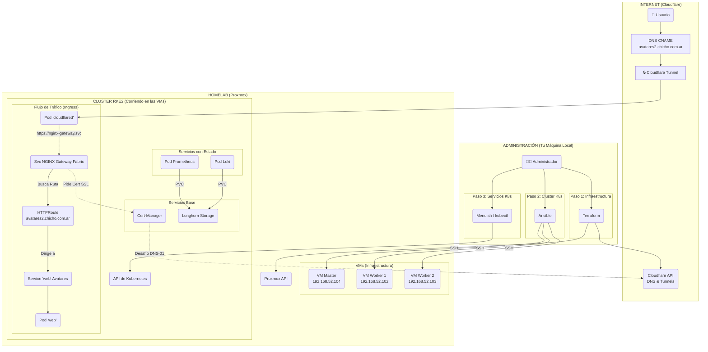

# RKE2 Homelab en Proxmox con Ansible, Terraform y Zero Trust

Este repositorio contiene la configuración completa de Infraestructura como Código (IaC) y automatización para desplegar un clúster de Kubernetes (RKE2) seguro y resiliente sobre Proxmox, expuesto a Internet de forma segura utilizando túneles de Cloudflare bajo un modelo **Zero Trust**.

El proyecto implementa una arquitectura **Zero Trust pura**, lo que significa que **no se requiere abrir puertos en el router** ni utilizar un balanceador de carga como MetalLB para el acceso externo. Todo el acceso se gestiona a través de túneles cifrados que se conectan directamente a los servicios internos del clúster.


## 🚀 Tecnologías Principales

  * **Hipervisor:** Proxmox VE
  * **IaC (Infraestructura):** Terraform
  * **Gestión de Configuración:** Ansible
  * **Kubernetes:** RKE2 (Rancher Kubernetes Engine 2)
  * **Red (Ingress):** NGINX Gateway Fabric (usando Gateway API)
  * **Red (Externa):** Cloudflare Tunnel
  * **Certificados:** Cert-Manager con desafío DNS-01 (vía Cloudflare)
  * **Almacenamiento:** Longhorn
  * **Monitoreo:** Kube-Prometheus-Stack

-----

## ✨ Características Clave

  * **Infraestructura como Código (IaC):** Las 3 VMs del clúster (1 master, 2 workers) se crean y configuran automáticamente con Terraform.
  * **Configuración Automatizada:** Ansible instala RKE2, configura el master, y une a los workers con un solo script.
  * **Arquitectura Zero Trust Pura:** No se usa MetalLB. El pod de Cloudflare Tunnel utiliza el DNS interno de Kubernetes (`.svc.cluster.local`) para enrutar el tráfico directamente al servicio `ClusterIP` del Gateway.
  * **Ingress Moderno:** Utiliza la **Gateway API** de Kubernetes, que es la evolución de Ingress, a través de NGINX Gateway Fabric.
  * **SSL Automático:** Cert-Manager genera y renueva automáticamente los certificados SSL/TLS para `*.chicho.com.ar` usando el desafío DNS-01 contra la API de Cloudflare.
  * **Instalador Centralizado:** Un menú interactivo en bash (`k8s/menu-install-k8sapps.sh`) simplifica la instalación ordenada de todos los componentes del clúster.
  * **Gestión de IaC Híbrida:** Terraform maneja tanto la infraestructura base (VMs) como la configuración de Cloudflare (Túneles y DNS), demostrando un flujo de trabajo unificado.

-----

## 📁 Estructura del Repositorio

```
.
├── k8s/                 # Scripts de instalación y manifiestos YAML para Kubernetes.
│   ├── app-test/
│   ├── argocd/
│   ├── avatares-deployment/
│   ├── cert-manager/
│   ├── cloudflare-tunnel/
│   ├── kite/
│   ├── kube-prom-stack/
│   ├── longhorn/
│   ├── nginx-fabric-gateway/
│   └── menu-install-k8sapps.sh  # <-- Punto de entrada para K8s
└── proxmox/             # Automatización de la infraestructura base.
    ├── ansible/         # Playbooks para instalar RKE2.
    │   └── deploy-cluster.sh  # <-- Punto de entrada para Ansible
    └── terraform/             # (Renombrado desde 'iac' para claridad)
        └── main.tf          # <-- Punto de entrada para Terraform
```

-----

## 🚀 Guía de Despliegue (Alto Nivel)

### Paso 1: Aprovisionar Infraestructura (Terraform)

1.  Navega a `proxmox/terraform/`
2.  Configura tus variables de Proxmox y Cloudflare (en un `.tfvars` o variables de entorno).
3.  Ejecuta `terraform init` y luego `terraform apply`.
4.  Esto creará las 3 VMs en Proxmox y configurará el Túnel y los DNS CNAME en Cloudflare.

### Paso 2: Instalar Cluster RKE2 (Ansible)

1.  Navega a `proxmox/ansible/`.
2.  Verifica que el inventario `hosts` coincida con las IPs de Proxmox.
3.  Ejecuta `./deploy-cluster.sh`.
4.  Al finalizar, Ansible habrá copiado el `kubeconfig` a tu máquina local (`~/.kube/config`) para que puedas usar `kubectl`.

### Paso 3: Desplegar Servicios del Cluster (Menú)

1.  Navega a `k8s/`.
2.  Ejecuta el menú interactivo: `bash menu-install-k8sapps.sh`.
3.  Sigue el orden numérico del menú para instalar la infraestructura base (Gateway, Cert-Manager, Túnel) y luego las aplicaciones que desees.

### Paso 4: ¡Listo\!

Una vez completado el menú, tus servicios (como `avatares2.chicho.com.ar`, `monitoreo-avatares2.chicho.com.ar`, etc.) estarán disponibles públicamente a través de Cloudflare, con SSL completo, sin un solo puerto abierto en tu router.



